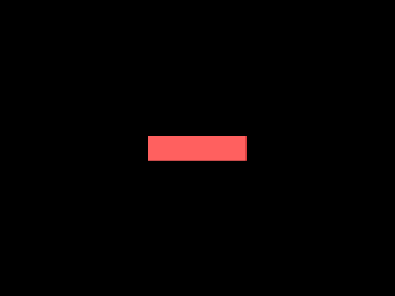
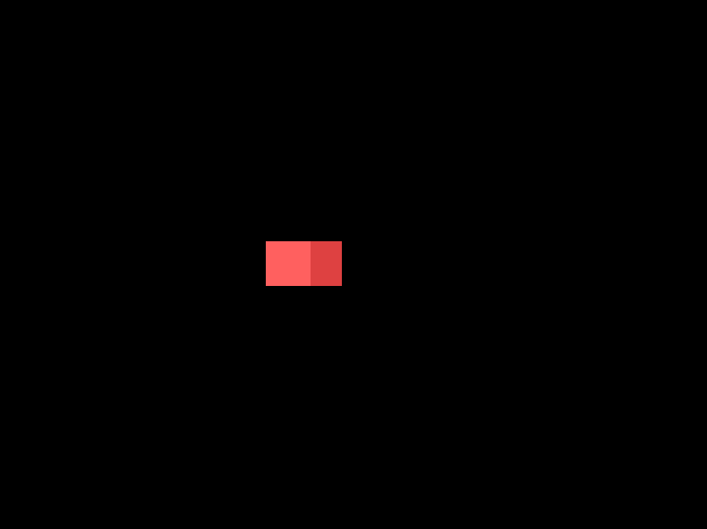

### 6. Create a Circle class that receives x, y and radius arguments in its constructor, has x, y, radius and creation_time attributes and has update and draw methods. The x, y and radius attributes should be initialized to the values passed in from the constructor and the creation_time attribute should be initialized to the relative time the instance was created (see love.timer). The update method should receive a dt argument and the draw function should draw a white filled circle centered at x, y with radius radius (see love.graphics). An instance of this Circle class should be created at position 400, 300 with radius 50. It should also be updated and drawn to the screen.

```lua
Circle = Object:extend()

function Circle:new(x, y, radius)
    self.x, self.y, self.radius = x, y, radius
    Circle.creation_time = love.timer.getTime()
end

function Circle:update(dt)

end

function Circle:draw()
    love.graphics.circle("fill", self.x, self.y, self.radius)
end
```

```lua
-- In main.lua
function love.load()
    circle = Circle(400, 300, 50)
end
```

### 7. Create an HyperCircle class that inherits from the Circle class. An HyperCircle is just like a Circle, except it also has an outer ring drawn around it. It should receive additional arguments line_width and outer_radius in its constructor. An instance of this HyperCircle class should be created at position 400, 300 with radius 50, line width 10 and outer radius 120.

```lua
HyperCircle = Circle:extend()

function HyperCircle:new(x, y, radius, line_width, outer_radius)
    HyperCircle.super.new(self, x, y, radius)
    self.line_width, self.outer_radius = line_width, outer_radius
    Circle.creation_time = love.timer.getTime()
end

function HyperCircle:update(dt)
    HyperCircle.super.update(self, dt)
end

function HyperCircle:draw()
    HyperCircle.super.draw(self)
    love.graphics.setLineWidth(self.line_width)
    love.graphics.circle("line", self.x, self.y, self.outer_radius)
    love.graphics.setLineWidth(1)
end
```
```lua
-- In main.lua
function love.load()
	hyperCircle = HyperCircle(400, 300, 50, 10, 120)
end
```

### 8. What is the purpose of the : operator in Lua? How is it different from . and when should either be used?
In Lua, the : operator is used for method invocation where the first agrument is self, while the . operator is used for accessing table fields, which can also be methods.

**Author's Answer:** The : operator in Lua is used as a shorthand for passing self as the first argument of a function when calling it. For instance, both of these lines are the same thing:

 
```lua
instance.method(instance, ...)

instance:method(...)
```
This is a very common pattern in Lua when you have functions that are operating on some object that are also defined on that object, which happens often with object oriented programming. For instance, let's say we have a table that contains fields x, y and add in it. x and y are values, and add is a function adds those two values together and returns them. One way to define this would be like this:

 
```lua
local t = {}

t.x = 5

t.y = 4

t.add = function(self)

    return self.x + self.y

end
```
Note that the add function receives a self argument. This argument corresponds to a table that contains that x and y attributes which we want to add. If we call it like this:

 
```lua
t:add()
```
Then we're passing the t table itself to the add function, and so the return result will be 9. Similarly, we could call it like this:

 
```lua
t.add(t)
```
And we'd achieve the same result. We could also define another table ```u``` with different ```x``` and ```y``` values, and then call ```t.add(u)``` and we'd get a different result other than 9, however this is generally not what people do. In general the way objects are built in Lua are like more like the first example where we called ```t:add()``` , since the table will be operating on its own values instead of on another table's values.

### 9. Suppose we have the following code:

```lua
function createCounterTable()
    return {
        value = 1,
        increment = function(self) self.value = self.value + 1 end,
    }
end

function love.load()
    counter_table = createCounterTable()
    counter_table:increment()
end
```
### What is the value of counter_table.value? Why does the increment function receive an argument named self? Could this argument be named something else? And what is the variable that self represents in this example?
counter_table.value is 2. ```increment``` function receive an argument named ```self```, so that the function uses the attributes of the tables (```value```) that calls it . If the argument is named something else than the argument is refering to something else bysides the table calling it, i.e. another table that isn't the the table calling ```increment()```. ```self``` represents the table returned from ```createCounterTable()```.

**Author's Answer:** This question expands on the previous question to test if you really understood the idea that tables can have functions defined in them that will change the table's own attributes.

The value of ```counter_table.value``` is initially what it was defined to be, which is 1. And then after the ```counter_table:increment()``` call it got changed to 2. ```counter_table:increment()``` is the same as ```counter_table.increment(counter_table)```, which means that the self variable in that function definition, in this example, corresponds to the counter_table variable itself, which is why counter_table.value was able to be incremented in the first place.

If we had defined another table called ```counter_table_2``` which had its ```.value``` attribute defined to 5, and then called ```counter_table.increment(counter_table_2)```, ```counter_table.value``` would still be 1 and ```counter_table_2.value``` would be 6.

### 10. Create a function that returns a table that contains the attributes a, b, c and sum. a, b and c should be initiated to 1, 2 and 3 respectively, and sum should be a function that adds a, b and c together. The final result of the sum should be stored in the c attribute of the table (meaning, after you do everything, the table should have an attribute c with the value 6 in it).
```lua
function createSumTable()
    return {
        a = 1, b = 2, c = 3,
        sum = function(self) self.c = self.a + self.b + self.c end,
    }
end

x = createSumTable()
x:sum()
```
**Author's Answer:** This question expands even further on the same concept to really make sure you get it. If you had to get help from the answers for the previous two questions and you couldn't get close to the answer by yourself then you need to spend more time on this idea before you move on. Understanding this is truly essential to understanding how Lua works.

The question is simply asking for a construct similar to the one used in the previous exercise. First it asks for a function that returns a table that contains attributes a, b, c and sum. Those should be initialized, respectively, to 1, 2, 3 and sum should be a function:

 
```lua
function createSumTable()

    return {

        a = 1,

        b = 2,

        c = 3,

        sum = function()

        end,

    }

end
```
After this it says that ```sum``` should add the previous 3 attributes together, with the final result being stored in the ```c``` attribute. This means that like the previous exercise, the ```sum``` function will receive some table that we'll name ```self```, and it could be any other table, but we'll most likely call the ```sum``` function from the table that contains that function definition itself:

 
```lua
function createSumTable()

    return {

        a = 1,

        b = 2,

        c = 3,

        sum = function(self)

            self.c = self.a + self.b + self.c

        end,

    }

end

​

t = createSumTable()

t:sum()

print(t.c) --> prints 6
```
### 11. If a class has a method with the name of ```someMethod``` can there be an attribute of the same name? If not, why not?
```lua
class.someMethod = ...
function class:someMethod()
end
```
I think should be fine, because the function ```someMethod``` should have ```:``` and the ```()``` while the attribute uses ```.```. *This is not correct.*

**Author's Answer:** It is possible for a table to have a method and an attribute of the same name, however things won't work as expected. Either the method or the attribute will overwrite what was there before and then that identifier will only function as one of them. For instance, if the method ```t.x``` is defined first and it's a function that does something, but then the attribute ```t.x``` is defined as the value 5, in the end it will be the value 5 and not the function, since the value was defined later and overwrote the function definition.

Because objects will be tables in Lua, this means that method names cannot be the same as attribute names, and that you can't have multiple methods with the same name, or multiple attributes with the same name in a Lua object. Of course, because Lua is flexible, there are ways to change this behavior using metatables and do a bunch of tricky things that to the end user will make it seem like you can have multiple definitions under the same name, but no Lua OOP library I know of does that and we won't really need it.

### 12. What is the global table in Lua?
I think it is the table that holds all the global variables.

**Author's Answer:** The global table is Lua is named ```_G``` and it holds references to all global variables in Lua. Whenever you defined a new variable, like ```a = 5```, what you're really doing is saying _G['a'] = 5, and you can access the a variable by saying ```_G.a```, for instance (on top of just saying a normally). 


### 13. Based on the way we made classes be automatically loaded, whenever one class inherits from another we have code that looks like this:
```lua
SomeClass = ParentClass:extend()
```
### Is there any guarantee that when this line is being processed the ParentClass variable is already defined? Or, to put it another way, is there any guarantee that ParentClass is required before SomeClass? If yes, what is that guarantee? If not, what could be done to fix this problem?
IDK, I would think the ```extend()``` method checks or guarantees that ParentClass exist. *This is not correct.*

**Author's Answer:** There is no guarantee that ```ParentClass``` is already defined in that situation. Based on the way we defined the loading of classes, the only thing that we know for sure is that classes are loaded in alphabetical order, other than that the order in which they're loaded, it is undefined. This means that with the way we do it now, there's no way to guarantee one class is always loaded before the other.

One way to solve this is to simply manually load classes that other classes depend on and then automatically load all other classes. In the game there are only a few classes that fit this definition so this is a suitable solution.


### 14. Suppose that all class files do not define the class globally but do so locally, like:
```lua
local ClassName = Object:extend()
...
return ClassName
```
### How would the requireFiles function need to be changed so that we could still automatically load all classes?
The ```requireFiles``` function would need to assign a global varible for each class. I am unsure of how to implement it. 
```lua
-- my first try
function requireFiles(files)
    for _, file in ipairs(files) do
        if file.sub(-4) == '.lua' then
            local last_foward_slash_index = file:match'^.*()/'
            print(last_foward_slash_index)
            local index = file:find("/[^/]*$")
            print(index)
            local class_name = file:sub(index)
            print(class_name)
            local file_path = file:sub(1, -5)
            _G[class_name] = require(file_path)
        end
    end
end

-- Automatically creates global variables for each class based on the filename
-- Since the class library returns a table, we can assign it to a global variable
function requireFiles(files)
    for _, file in ipairs(files) do
        if file:sub(-4) == '.lua' then
            local file_path = file:sub(1, -5) -- remove .lua extension from filename
            local last_foward_slash_index = file_path:find("/[^/]*$")
            local class_name = file_path:sub(last_foward_slash_index + 1, #file_path)
			--the # operator in Lua is used to get the length of a string or a table
			-- or local class_name = file_path:sub(index+1)
			_G[class_name] = require(file_path)
        end
    end
end
```

**Author's Answer:** In this new way of doing it, the class is returned instead of automatically being assigned to a global variable. So the only thing we have to change in the requireFiles function is making sure that assignment to a global variable happens. The way the current function looks is like this:

 
```lua
function requireFiles(files)

    for _, file in ipairs(files) do

        local file = file:sub(1, -5)

        require(file)

    end

end
```
If we print the file variable we'll get strings like this, for instance: ```objects/ObjectName``` , where ```ObjectName``` will be the name of some class, and there will be multiple of those strings. What we want to do is take ```ObjectName``` out of this full ```objects/ObjectName``` string, and then use that as the name of our global variable, so essentially we'll be doing ```_G[ObjectName] = require(file)```. The only thing we have to do then is successfully remove the class name from the full path that we have in the ```file``` variable.

To achieve this we can first find the last ```/``` character. It has to be the last because the full path can have other folders in it in the future, like ```objects/Enemies/EnemyName```. To do this I just googled "find last specific character in string Lua" and I got this page https://stackoverflow.com/questions/14554193/last-index-of-character-in-string where someone already had the answer for the exact character we need even. So applying that to our case:

 
```lua
local file = file:sub(1, -5)

local last_forward_slash_index = file:find("/[^/]*$")

local class_name = file:sub(last_forward_slash_index+1, #file)
```
First we find the index of the last forward slash using the code from the StackOverflow question. Then we take that index and use the ```string.sub``` function to split the string, from the index found + 1 (because we don't want the forward slash in the final string) to the end of the string. This gets us exactly what we want and so the ```class_name``` variable will contain the name of the class we wanted. Now it's just a matter of loading that globally:

 
```lua
local file = file:sub(1, -5)

local last_forward_slash_index = file:find("/[^/]*$")

local class_name = file:sub(last_forward_slash_index+1, #file)

_G[class_name] = require(file)
```
Another thing that can be done here is that unload a class if it was previously loaded. This might never be useful but it's useful to know that it can be done: by calling ```package.loaded[file] = nil``` before the ```require(file)``` call, we can clear the cache that holds all files that have been previously loaded and force a full reload of that file. This is useful in a number of situations, like if we wanted to implement hot-reloading of our code.

### 15. Suppose we have the following code:
```lua
function love.load()
    input = Input()
    input:bind('mouse1', function() print(love.math.random()) end)
end
```
Will anything happen when mouse1 is pressed? What about when it is released? And held down?

When mouse1 is pressed, it will print a random number in the console/terminal. released? No. And held down? No, prints once even after holding the key down.

**Author's Answer:** For this question all that really has to be done is to test the code and see that whenever ```mouse1``` is pressed (not released nor held) the function runs. This is an alternate thing you can do with the bind function, which is to just bind a key to a function that will be executed when the key is pressed.

###  16. Bind the keypad ```+``` key to an action named ```add```, then increment the value of a variable named ```sum``` (which starts at 0) by 1 every ```0.25``` seconds when the ```add``` action key is held down. Print the value of ```sum``` to the console every time it is incremented.

```lua
function love.load()
    input = Input()
    sum = 0
    input:bind('+', 'add')
end

function love.update(dt)
    if (input:down('add', 0.25)) then 
        sum = sum + 1
        print(sum)
    end
end
```
almost correct: ```+``` is supposed to be ```kp+```.

**Author's Answer:** For this question we need to first bind the keypad + key to an action named add. To do that we need to figure out what's the string used to represent keypad +. The github page links to this page for key constants and says that for the keyboard they are the same, which means that keypad ```+``` is ```kp+```. And so the code looks like this:

 
```lua
function love.load()
    input = Input()
    input:bind('kp+', 'add')
end
```
Then the question asks to increment a sum variable every 0.25 seconds when the add action key is held down and to print the result to the console. This is simply an application of the pressRepeat function:

 
```lua
function love.load()
    input = Input()
    input:bind('kp+', 'add')
    sum = 0
end


function love.update(dt)
    if input:pressRepeat('add', 0.25) then
        sum = sum + 1
        print(sum)
    end
end
```

### 17. Can multiple keys be bound to the same action? If not, why not? And can multiple actions be bound to the same key? If not, why not?
Yes, multiple keys can be bound to the same action. Just bind that key to the action using input:bind(). No, multiple actions can not be bound to the same key, because the bind function replaces the action for a key on each call to bind(). (self.functions[key] = action;)
I was wrong. Multiple actions caan be bound to the same key.

**Author's Answer:** Multiple keys can be bound to the same action. What will happen when an action is checked for is that all the keys will be checked for at the same time, so if any of the keys was pressed an event will be generated for that action. Similarly, multiple actions can be bound to the same key and whenever the key is pressed, all actions bound to it will have an event generated for them.

### 18. If you have a gamepad, bind its DPAD buttons(fup, fdown...) to actions up, left, right and down and then print the name of the action to the console once each button is pressed.

```lua
function love.load()
    input = Input()
    input:bind('fup', 'up')
    input:bind('fleft', 'left')
    input:bind('fright', 'right')
    input:bind('fdown', 'down')
end

function love.update(dt)
    if (input:pressed('up')) then print("up") end
    if (input:pressed('left')) then print("left") end
    if (input:pressed('right')) then print("right") end
    if (input:pressed('down')) then print("down") end
end
```
correct

**Author's Answer:** same 

### 19. If you have a gamepad, bind one of its ```trigger``` buttons (l2, r2) to an action named trigger. Trigger buttons return a value from 0 to 1 instead of a boolean saying if its pressed or not. How would you get this value?
You could check if the value returned from pressing the trigger is greater than 0.5 in order to set it to true else it's false.

I kind of had the right idea, but used the wrong function.

**Author's Answer:** Here we see how values that are not booleans can be used. In the case of triggers, ```down``` can be used to access the value which will be somewhere between 0 and 1, depending on how hard the trigger is being pressed. 
```lua
function love.load()
    ...
    input:bind('l2', 'trigger')
end

​

function love.update(dt)
    ...
    local left_trigger_value = input:down('trigger')
    print(left_trigger_value)
end
```

### 20. Repeat the same as the previous exercise but for the left and right stick's horizontal and vertical position.
Same as the answer for 19
```lua
function love.load()
    ...
    input:bind('leftx', 'left_horizontal')
    input:bind('lefty', 'left_vertical')
    input:bind('rightx', 'right_horizontal')
    input:bind('righty', 'right_vertical')
end

​

function love.update(dt)
    ...
    local left_stick_horizonal = input:down('left_horizontal')
    local left_stick_vertical = input:down('left_vertical')
    local right_stick_horizontal = input:down('right_horizontal')
    local right_stick_vertical = input:down('right_vertical')
    print(left_stick_horizonal, left_stick_vertical)
    print(right_stick_horizontal, right_stick_vertical)
end
```

**Author's Answer:** same

### 21. Using only a ```for``` loop and one declaration of the ```after``` function inside that loop, print 10 random numbers to the screen with an interval of 0.5 seconds between each print.

```lua
Timer = require 'libraries/chrono/Timer'

chronotimer = Timer()
	for i = 1, 10 do
		chronotimer:after(0.5*i, function() print(love.math.random()) end)
	end
```

**Author's Answer:** For this question we need to print 10 random numbers with a 0.5 interval between each print using only a for and an after call inside that loop. The thing to do on instinct is something like this:

```lua
for i = 1, 10 do

    timer:after(0.5, function() print(love.math.random()) end)

end
```
But this will print 10 numbers exactly at the same time after an initial interval of 0.5 seconds, which is not what we wanted. What we did here is just call timer:after 10 times. Another thing one might try is to somehow chain after calls together like this:

 
```lua
timer:after(0.5, function()

    print(love.math.random())

    timer:after(0.5, function()

        print(love.math.random())

        ...

    end)

end)
```
And then somehow translate that into a for, but there's no reasonable way to do that. The solution lies in figuring out that if you use the i index from the loop and multiply that by the 0.5 delay, you'll get delays of 0.5, then 1, then 1.5, ... until you get to the last value of 5. And that looks like this:

 
```lua
for i = 1, 10 do

    timer:after(0.5*i, function() print(love.math.random()) end)

end
```
The first number is printed after 0.5 seconds and then the others follow. If we needed the first number to printed immediately (instead of with an initial 0.5 seconds delay) then we needed to use i-1 instead of i.

### 22. Suppose we have the following code:
```lua
function love.load()
    timer = Timer()
    rect_1 = {x = 400, y = 300, w = 50, h = 200}
    rect_2 = {x = 400, y = 300, w = 200, h = 50}
end

function love.update(dt)
    timer:update(dt)
end

function love.draw()
    love.graphics.rectangle('fill', rect_1.x - rect_1.w/2, rect_1.y - rect_1.h/2, rect_1.w, rect_1.h)
    love.graphics.rectangle('fill', rect_2.x - rect_2.w/2, rect_2.y - rect_2.h/2, rect_2.w, rect_2.h)
end
```
Using only the tween function, tween the w attribute of the first rectangle over 1 second using the in-out-cubic tween mode. After that is done, tween the h attribute of the second rectangle over 1 second using the in-out-cubic tween mode. After that is done, tween both rectangles back to their original attributes over 2 seconds using the in-out-cubic tween mode. It should look like
[this:](https://camo.githubusercontent.com/95f1d4a1b3b5a7e12d99555c3a227e610c88226d5331d6fddbcb288c0f4b5904/68747470733a2f2f692e696d6775722e636f6d2f514f5074344a632e676966)

```lua
    chronotimer:tween(1, rect_1, {w = 0}, 'in-out-cubic')
	chronotimer:after(1, function()
		chronotimer:tween(1, rect_2, {h = 0}, 'in-out-cubic')
	end)
	chronotimer:after(2, function()
		chronotimer:tween(2, rect_1, {w = 50}, 'in-out-cubic')
		chronotimer:tween(2, rect_2, {h = 50}, 'in-out-cubic')
	end)
```
I didn't realize the fuction param could be used for chaining tweens.

**Author's Answer:** This question asks for a bunch of tweens that happens in sequence after one another. This is just a simple application of the tween function using the optional last argument to chain tweens together. That looks like this:

```lua
timer:tween(1, rect_1, {w = 0}, 'in-out-cubic', function()

    timer:tween(1, rect_2, {h = 0}, 'in-out-cubic', function()

        timer:tween(2, rect_1, {w = 50}, 'in-out-cubic')

        timer:tween(2, rect_2, {h = 50}, 'in-out-cubic')

    end)

end)
```

### 23. For this exercise you should create an HP bar. Whenever the user presses the d key the HP bar should simulate damage taken. It should look like this:
As you can see there are two layers to this HP bar, and whenever damage is taken the top layer moves faster while the background one lags behind for a while.



```lua
function love.load()
	
	hp_bar_f = {x = 400, y = 300, w = 200, h = 50}
    hp_bar_b = {x = 400, y = 300, w = 200, h = 50}

	set_x_fg = hp_bar_f.x - hp_bar_f.w/2
	set_x_bg = hp_bar_b.x - hp_bar_b.w/2
	
    input = Input()
    input:bind('d', 'damage')

	chronotimer = Timer()

end


function love.update(dt)
	--hyperCircle:update(dt)
	if input:pressed('damage') then
		chronotimer:tween(0.5, hp_bar_f, {w = hp_bar_f.w - 20}, 'in-out-cubic', function()
			chronotimer:after(0.25, function() 
				chronotimer:tween(0.5, hp_bar_b, {w = hp_bar_b.w - 20}, 'in-out-cubic', function() end, 'bg_tween')
			end, 'bg_after')
		end, 'fg')
	end

	chronotimer:update(dt)
end


function love.draw()
	love.graphics.setColor(1, 0, 0)
	love.graphics.rectangle('fill', set_x_bg, hp_bar_b.y - hp_bar_b.h/2, hp_bar_b.w, hp_bar_b.h)  --can't use hp_bar_f.x - hp_bar_f.w/2 bc it changes during tween
	love.graphics.setColor(0.9, 0.3, 0.1)
	love.graphics.rectangle('fill', set_x_fg, hp_bar_f.y - hp_bar_f.h/2, hp_bar_f.w, hp_bar_f.h)
	
	love.graphics.setColor(1, 1, 1)
end
```

**Author's Answer:** For this one we need to define two structures, one for which will be the front layer and one that will the background layer of the HP bar. We'll define them simply like tables:

 
```lua
function love.load()

    ...

    hp_bar_bg = {x = gw/2, y = gh/2, w = 200, h = 40}

    hp_bar_fg = {x = gw/2, y = gh/2, w = 200, h = 40}

end
```
Here we simply define the x, y position and w, h size of the rectangle for both the front and back layer. To draw them we can simply use love.graphics.rectangle:

 
```lua
function love.draw()

    ...

    love.graphics.setColor(222, 64, 64)

    love.graphics.rectangle('fill', hp_bar_bg.x, hp_bar_bg.y - hp_bar_bg.h/2, hp_bar_bg.w, hp_bar_bg.h)

    love.graphics.setColor(222, 96, 96)

    love.graphics.rectangle('fill', hp_bar_fg.x, hp_bar_fg.y - hp_bar_fg.h/2, hp_bar_fg.w, hp_bar_fg.h)

    love.graphics.setColor(255, 255, 255)

end
```
After drawing it, all we need to do is bind the d key to make the front layer move, and then after a small delay make the background layer move as well. We can use the tween function from a timer to achieve this:

 
```lua
function love.keypressed(key)

    if key == 'd' then

        timer:tween('fg', 0.5, hp_bar_fg, {w = hp_bar_fg.w - 25}, 'in-out-cubic')

        timer:after('bg_after', 0.25, function()

            timer:tween('bg_tween', 0.5, hp_bar_bg, {w = hp_bar_bg.w - 25}, 'in-out-cubic')

        end)

    end

end
```
And so at first we decrease the width of the front bar by 25, and then after 0.25 seconds we do the same for the background bar. One important thing to notice is that all calls that use the timer have a name. This is because whenever we press the key and another previous tween is happening (like if you press the key multiple times really fast), then we want to cancel the previous tween so that two tweens aren't operating on the same variable at once.

### 24. Taking the previous example of the expanding and shrinking circle, it expands once and then shrinks once. How would you change that code so that it expands and shrinks continually forever?

```lua
function love.load()
	local object_files = {}
	recursiveEnumerate('objects', object_files)
	requireFiles(object_files)

	circle = {x = 400, y = 300, radius = 50}

    input = Input()

	chronotimer = Timer()

	chronotimer:every(2, function() 
		chronotimer:tween(1, circle, {radius = 100}, 'in-out-cubic', function()
			chronotimer:tween(1, circle, {radius = 50}, 'in-out-cubic')
		end)
	end)
	
end

function love.update(dt)
	chronotimer:update(dt)
end

function love.draw()
	love.graphics.circle('fill', circle.x, circle.y, circle.radius)
end
```

**Author's Answer:** The easiest way to do this is to change the timer:after call to be timer:every instead:

```lua
function love.load()

    ...

    timer:every(12, function()

        timer:tween(6, circle, {radius = 96}, 'in-out-cubic', function()

            timer:tween(6, circle, {radius = 24}, 'in-out-cubic')

        end)

    end)

end
```
The duration of the every call should be the sum of the duration of both the expand and shrink tween inside it, so in this case it goes on for 12 seconds, since each tween goes for 6 seconds.


### 25. Accomplish the results of the previous exercise using only the after function.

```lua
function circleAnimation()

	chronotimer:tween(1, circle, {radius = 100}, 'in-out-cubic', function()
		chronotimer:tween(1, circle, {radius = 50}, 'in-out-cubic')
	end)
	chronotimer:after(2, circleAnimation)

end

function love.load()
	...

	chronotimer:after(0, function()
		chronotimer:tween(1, circle, {radius = 100}, 'in-out-cubic', function()
			chronotimer:tween(1, circle, {radius = 50}, 'in-out-cubic')
		end)
		chronotimer:after(2, circleAnimation)
	end)
end


```

**Author's Answer:** The only difference with this exercise is that instead of using every we have to use multiple after calls to simulate every, which is something that the timer library supports:
 
```lua
function love.load()

    ...

    timer:after(0, function(f)

        timer:tween(6, circle, {radius = 96}, 'in-out-cubic', function()

            timer:tween(6, circle, {radius = 24}, 'in-out-cubic')

        end)

        timer:after(12, f)

    end)

end 
```

### 26. Bind the e key to expand the circle when pressed and the s to shrink the circle when pressed. Each new key press should cancel any expansion/shrinking that is still happening.

```lua
function love.load()
	...
    input = Input()

	input:bind("e", 'expand')
	input:bind("s", 'shrink')

	chronotimer = Timer()
	
end


function love.update(dt)

    if input:pressed('expand') then

		chronotimer:cancel('shrink_tween')
		chronotimer:tween(3, circle, {radius = 100}, 'in-out-cubic', nil, 'expand_tween')
	
    elseif input:pressed('shrink') then

		chronotimer:cancel('expand_tween')
		chronotimer:tween(3, circle, {radius = 50}, 'in-out-cubic', nil, 'shrink_tween')
	
    end

	chronotimer:update(dt)

end
```

**Author's Answer:** This question asks for the application of the naming system in a tween, like in question 23. So the easiest way to do that is to break down each part of the behavior (expand, shrink) and tie it to the different keys:
 
```lua
function love.keypressed(key)

    if key == 'e' then

        timer:tween('expand', 6, circle, {radius = 96}, 'in-out-cubic')

    elseif key == 's' then

        timer:tween('shrink', 6, circle, {radius = 24}, 'in-out-cubic')

    end

end
```
With this, whenever the user presses either e or s, the circle will expand or shrink appropriately. However, if the other key is pressed while the tween from the previous press is happening, then two tweens will be operating on the same variable at the same time and bugs will happen. For instance, if you press e and then 2 seconds later you press s, for 4 seconds both tweens will be active.

To fix this we need to actively cancel other tweens that might be active. In the case of expand, cancel shrink, and in the case of shrink, cancel expand:

```lua
function love.keypressed(key)

    if key == 'e' then

        timer:cancel('shrink')

        timer:tween('expand', 6, circle, {radius = 96}, 'in-out-cubic')

    elseif key == 's' then

        timer:cancel('expand')

        timer:tween('shrink', 6, circle, {radius = 24}, 'in-out-cubic')

    end

end
```
We don't need to also call the cancel function for the same tag (i.e. calling timer:cancel('expand') when e is pressed) because when the tween call has a tag attached to it it automatically does that once the tag is repeated in another call.


### 27. Suppose we have the following code:
```lua
function love.load()
    timer = Timer()
    a = 10  
end

function love.update(dt)
    timer:update(dt)
end
```
### Using only the ```tween``` function and without placing the ```a``` variable inside another table, how would you tween its value to 20 over 1 second using the ```linear``` tween mode?

```lua
function love.load()
    chronotimer = Timer()
	a = 10
	chronotimer:tween(1, _G, {a = 20}, 'linear')
end
```

**Author's Answer:** The problem this question is asking about is how to change a variable that is not inside a table with the tween function. The second argument of the tween method receives a table, and then in the next argument after that the attribute that is to be changed can be specified. But how do we do this if a variable is not in a table, like a free floating global variable? The answer is to remember that all global variables in Lua are inside the _G table:

```lua
timer:tween(1, _G, {a = 20}, 'linear')
```
In this way, the a variable will have its value changed in the way the question asked. It's worth noting that I don't think there's a way of doing this if the variable was defined locally, since in that case the variable wouldn't be in the global environment table.

For the answers for the table exercises, it's assumed that the moses library was initiated to the fn global variable.

### 28. Print the contents of the ```a``` table to the console using the each function.


### 29. Count the number of 1 values inside the ```b``` table.

### 30. Add 1 to all the values of the d table using the map function.

### 31. Using the map function, apply the following transformations to the ```a``` table: if the value is a number, it should be doubled; if the value is a string, it should have 'xD' concatenated to it; if the value is a boolean, it should have its value flipped; and finally, if the value is a table it should be omitted.

### 32. Sum all the values of the d list. The result should be 23.

### 33. Suppose you have the following code:
```lua
if _______ then
    print('table contains the value 9')
end
```
### Which function from the library should be used in the underscored spot to verify if the b table contains or doesn't contain the value 9?

### 34. Find the first index in which the value 7 is found in the c table.

### 35. Filter the d table so that only numbers lower than 5 remain.

### 36. Filter the c table so that only strings remain.

### 37. Check if all values of the c and d tables are numbers or not. It should return false for the first and true for the second.

### 38. Shuffle the d table randomly.

### 39. Reverse the d table.

### 40. Remove all occurrences of the values 1 and 4 from the d table.

### 41. Create a combination of the b, c and d tables that doesn't have any duplicates.

### 42. Find the common values between b and d tables.

### 43. Append the b table to the d table.